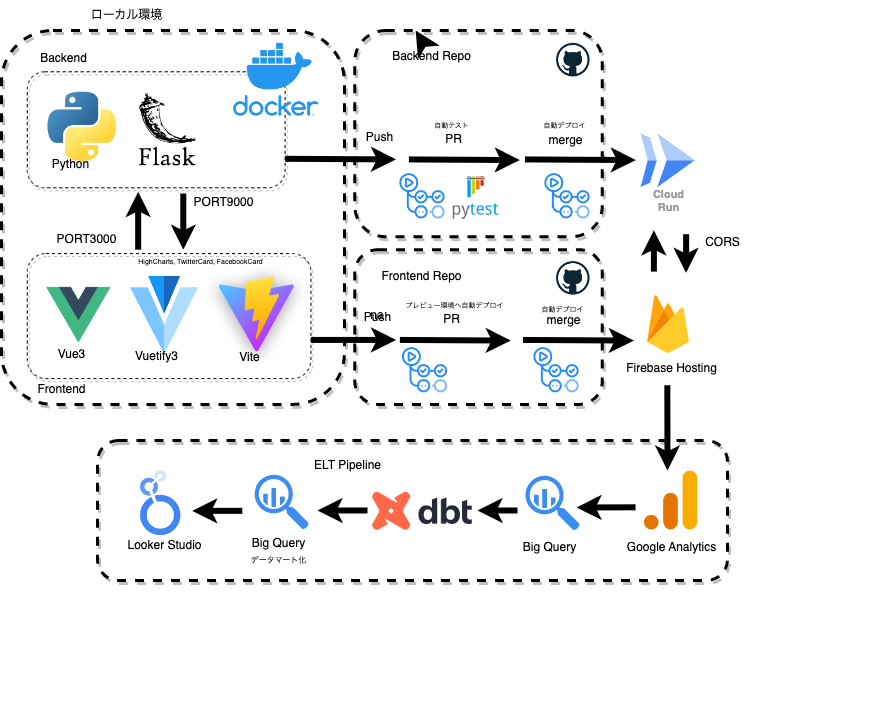
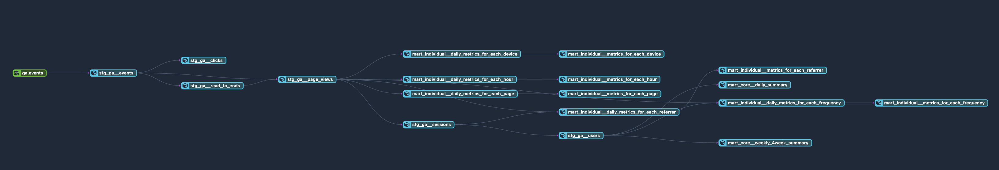
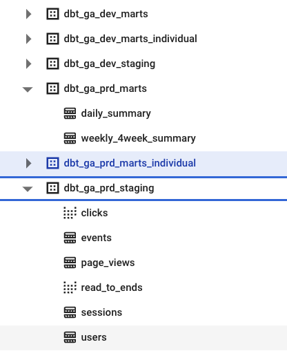

## asset-management-simulation-frontend

- 自作のWebAppである資産運用シミュレーションのELTパイプラインに関するレポジトリです。
- フロントエンドのレポジトリは [こちら](https://github.com/spider-man-tm/asset-management-simulation-frontend)をご参照ください。
- バックエンドのレポジトリは [こちら](https://github.com/spider-man-tm/asset-management-simulation-backend)をご参照ください。

 

### Overview
- アプリと連携した Google Analytics GA4 のデータに関してBigQueryと日次で自動連携を行なっています。
  - 日付別にシャーディングされた`events*`テーブルが保存されていきます。
  - SPAですがroutingに沿ってページ内コンテンツの遷移も追えるよう設計しています。
- BigQuery上に保存された`events*`テーブルをマート化していくデータ基盤部分をdbtを使って構築しています。

- 開発時には{開発環境用で定義されたtarget_name}_{dbt_project.ymlで定義したスキーマ名}データセットに各モデルの結果が保存されていきます。
- 本番ジョブを用意して、そこではスケジュールに沿って{本番環境用で定義されたtarget_name}_{dbt_project.ymlで定義したスキーマ名}データセットに各モデルの結果が保存されていきます。

- 各ディレクトの構成、マクロ関数、モデル、スキーマの定義やテストについてはdbt公式に沿って作成していますので詳細はそちらを参照ください。
